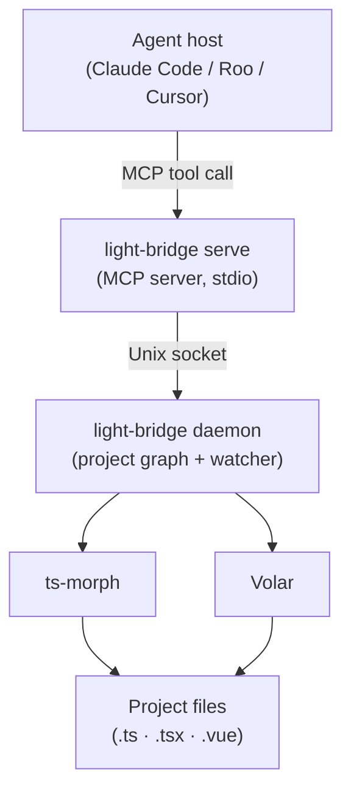

# light-bridge

A refactoring bridge between AI coding agents and the compiler APIs that understand your codebase.

AI agents can read and write files, but cross-file refactoring is expensive. Renaming a shared symbol or moving a file means loading every affected file into context, manually patching import paths, and hoping nothing is missed. light-bridge removes that burden — the agent issues an intent, light-bridge handles the cascade, and the agent gets back a semantic summary without ever seeing the raw diffs.

## How it works

light-bridge has two layers:

**Daemon** — a long-lived process that loads the project graph into memory and watches the filesystem for changes. It stays alive between agent sessions so the engine is always warm. Start it once; it handles the rest.

**MCP server** (`light-bridge serve`) — a thin process started by the agent host for each session. It connects to the running daemon, receives tool calls from the agent over stdio, and returns semantic summaries. If no daemon is running, it spawns one automatically.

The underlying language intelligence comes from ts-morph (pure TypeScript projects) and Volar (projects containing Vue files), covering both `.ts` and `.vue` files in a unified project graph.

The agent calls tools. light-bridge applies changes. The context window stays clean.



## CLI Commands

### `light-bridge daemon`

Start the daemon for a workspace. Loads the project graph, starts the filesystem watcher, and listens for connections from `serve` instances.

```bash
light-bridge daemon --workspace /path/to/project
```

Output (stderr):

```json
{ "status": "ready", "workspace": "/absolute/path/to/project" }
```

The daemon runs until terminated with SIGTERM or SIGINT. It does not exit when agent sessions end.

### `light-bridge serve`

Start the MCP server for an agent session. Connects to the running daemon (spawning it if needed) and accepts tool calls over stdio.

```bash
light-bridge serve --workspace /path/to/project
```

Output (stderr):

```json
{ "status": "ready", "workspace": "/absolute/path/to/project" }
```

Terminates cleanly on SIGTERM. The daemon continues running after the session ends.

### `light-bridge rename`

Rename a symbol at a given position and update all references project-wide.

```bash
light-bridge rename \
  --file src/utils/math.ts \
  --line 5 \
  --col 10 \
  --newName calculateTotal
```

### `light-bridge move`

Move a file and update all import paths that reference it.

```bash
light-bridge move \
  --oldPath src/utils/helpers.ts \
  --newPath src/lib/helpers.ts
```

## Response format

All operations return a JSON summary:

```json
{
  "ok": true,
  "filesModified": ["src/utils/math.ts", "src/index.ts"],
  "message": "Renamed 'calculateSum' to 'calculateTotal' in 2 files"
}
```

On failure:

```json
{
  "ok": false,
  "error": "SYMBOL_NOT_FOUND",
  "message": "Could not find symbol at line 5, column 10"
}
```

## Error codes

- `VALIDATION_ERROR` — invalid command arguments
- `FILE_NOT_FOUND` — source file does not exist
- `TSCONFIG_NOT_FOUND` — no TypeScript configuration found
- `SYMBOL_NOT_FOUND` — symbol not found at specified position
- `RENAME_NOT_ALLOWED` — symbol cannot be renamed (e.g. built-in types)
- `ENGINE_ERROR` — unexpected error during refactoring
- `DAEMON_STARTING` — daemon is still initialising; retry the tool call

## Agent integration

`light-bridge serve` is a stdio MCP server. Configure your agent host to launch it for the workspace you want to refactor.

### Claude Code

Add to `.mcp.json` in your project root (checked into version control, shared with your team):

```json
{
  "mcpServers": {
    "light-bridge": {
      "type": "stdio",
      "command": "node",
      "args": ["/absolute/path/to/light-bridge/dist/cli.js", "serve", "--workspace", "/absolute/path/to/your/project"]
    }
  }
}
```

Or use the CLI to add it to your local scope:

```bash
claude mcp add light-bridge -- node /absolute/path/to/light-bridge/dist/cli.js serve --workspace /absolute/path/to/your/project
```

### Roo

Open the Roo MCP settings (gear icon → MCP Servers) and add:

```json
{
  "mcpServers": {
    "light-bridge": {
      "command": "node",
      "args": ["/absolute/path/to/light-bridge/dist/cli.js", "serve", "--workspace", "/absolute/path/to/your/project"],
      "disabled": false,
      "alwaysAllow": ["rename", "move"]
    }
  }
}
```

### Notes

- Replace paths with absolute paths — relative paths are not supported in MCP configs.
- The daemon auto-spawns on first tool call if not already running. For faster first-call response, start it manually: `light-bridge daemon --workspace /path/to/project`.
- One `serve` instance per agent session; one daemon per workspace. The daemon keeps running between sessions.

## Development

### Prerequisites

- Node.js 18+
- pnpm 8+

### Setup

```bash
pnpm install
```

### Build

```bash
pnpm run build
```

### Test

```bash
pnpm run test
```

Tests include:

- **Unit tests** — engine operations in isolation (`tests/engines/`)
- **Integration tests** — CLI operations via subprocess (`tests/rename.test.ts`, `tests/move.test.ts`, `tests/vue.test.ts`)
- **Daemon tests** — lifecycle, socket, and serve integration (`tests/daemon/`)

### Smoke test

Verify the CLI is working end-to-end without running the full test suite:

```bash
pnpm smoke-test
```

This runs `rename` and `move` against copies of the test fixtures and reports pass/fail for each check.

## Project structure

```
src/
├── cli.ts                 # CLI entry point and command dispatcher
├── commands/
│   ├── rename.ts          # Rename command
│   ├── move.ts            # Move command
│   ├── daemon.ts          # Daemon process
│   └── serve.ts           # MCP server (thin client to daemon)
├── engines/
│   ├── ts-engine.ts       # TypeScript engine (ts-morph)
│   ├── vue-engine.ts      # Vue engine (Volar)
│   └── types.ts           # Shared types
├── router.ts              # Routes operations to the correct engine
├── project.ts             # Project utilities
├── schema.ts              # Zod input validation
└── output.ts              # JSON output formatting

tests/
├── engines/
│   ├── ts-engine.test.ts  # TsEngine unit tests
│   └── vue-engine.test.ts # VueEngine unit tests
├── daemon/
│   ├── paths.test.ts      # Socket/lockfile path utilities
│   ├── daemon.test.ts     # Daemon lifecycle integration tests
│   └── serve.test.ts      # serve↔daemon integration tests
├── rename.test.ts         # CLI integration tests (rename)
├── move.test.ts           # CLI integration tests (move)
├── vue.test.ts            # CLI integration tests (Vue cross-boundary)
├── helpers.ts             # Test utilities
└── fixtures/              # Test fixture projects
```

## License

MIT
