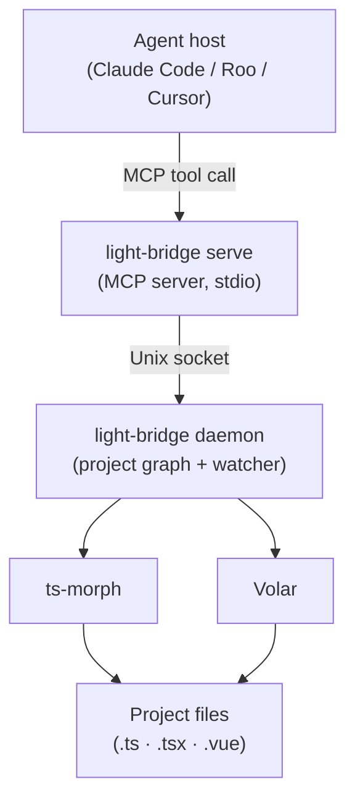

# light-bridge

A refactoring bridge between AI coding agents and the compiler APIs that understand your codebase.

> **Experimental.** This project is in active development. The goal is deterministic, token-reducing refactoring for AI agents through compiler-driven semantics, drawing inspiration from IDE integration patterns. Core operations are stable and tested, but some features remain incomplete or will evolve as we explore better approaches.

AI agents can read and write files, but cross-file refactoring is expensive. Renaming a shared symbol or moving a file means loading every affected file into context, manually patching import paths, and hoping nothing is missed. light-bridge removes that burden — the agent issues an intent, light-bridge handles the cascade, and the agent gets back a semantic summary without ever seeing the raw diffs.

**[Why light-bridge?](docs/why.md)** — speed, determinism, and context efficiency; how it fits into the AI coding ecosystem.

## How it works

light-bridge has two layers:

**Daemon** — a long-lived process that loads the project graph into memory and watches the filesystem for changes. It stays alive between agent sessions so the engine is always warm. Start it once; it handles the rest.

**MCP server** (`light-bridge serve`) — a thin process started by the agent host for each session. It connects to the running daemon, receives tool calls from the agent over stdio, and returns semantic summaries. If no daemon is running, it spawns one automatically.

The underlying language intelligence comes from ts-morph (pure TypeScript projects) and Volar (projects containing Vue files), covering both `.ts` and `.vue` files in a unified project graph.

The agent calls tools. light-bridge applies changes. The context window stays clean.



## Installation

```bash
pnpm add -D @yearofthedan/light-bridge
# or
npm install -D @yearofthedan/light-bridge
```

Or install from GitHub for unreleased builds:

```bash
pnpm add -D github:yearofthedan/light-bridge
```

## CLI Commands

### `light-bridge daemon`

Start the daemon for a workspace. Loads the project graph, starts the filesystem watcher, and listens for connections from `serve` instances.

```bash
light-bridge daemon --workspace /path/to/project
```

Output (stderr):

```json
{ "status": "ready", "workspace": "/absolute/path/to/project" }
```

The daemon runs until terminated with SIGTERM or SIGINT. It does not exit when agent sessions end.

### `light-bridge serve`

Start the MCP server for an agent session. Connects to the running daemon (spawning it if needed) and accepts tool calls over stdio.

```bash
light-bridge serve --workspace /path/to/project
```

Output (stderr):

```json
{ "status": "ready", "workspace": "/absolute/path/to/project" }
```

Terminates cleanly on SIGTERM. The daemon continues running after the session ends.

### `light-bridge stop`

Stop a running daemon for a workspace.

```bash
light-bridge stop --workspace /path/to/project
```

Output (stdout):

```json
{ "ok": true, "stopped": true }
```

## MCP tools

All refactoring operations are exposed as MCP tools via `light-bridge serve`. The agent host calls them; light-bridge handles the cascade.

| Tool | TS | Vue | Read-only | Notes |
|---|---|---|---|---|
| `rename` | ✓ | ✓ | no | Renames a symbol at a given position; updates every reference project-wide |
| `moveFile` | ✓ | ✓ | no | Moves a file; rewrites all import paths that reference it |
| `moveDirectory` | ✓ | ✓ | no | Moves an entire directory; rewrites all imports across the project |
| `moveSymbol` | ✓ | ✓* | no | Moves a named export to another file; updates all importers |
| `deleteFile` | ✓ | ✓† | no | Deletes a file; removes every import and re-export of it across the workspace |
| `extractFunction` | ✓ | — | no | Extracts a selected block of statements into a new named function at module scope |
| `findReferences` | ✓ | ✓ | yes | Returns every reference to the symbol at a given position |
| `getDefinition` | ✓ | ✓ | yes | Returns definition location(s) for the symbol at a given position |
| `getTypeErrors` | ✓ | — | yes | Returns type errors for a single file or whole project (capped at 100) |
| `searchText` | n/a | n/a | yes | Regex search across workspace files with optional glob/context controls |
| `replaceText` | n/a | n/a | no | Regex replace-all (pattern mode) or exact-position edits (surgical mode) |

All tools take absolute paths. Write operations return `filesModified` and `filesSkipped` (files outside the workspace boundary that were not touched). Write operations also accept `checkTypeErrors: true` to return type diagnostics for modified files in the same response — see `getTypeErrors` for the diagnostic shape.

\* `moveSymbol` supports moving exports from `.ts`/`.tsx` sources inside Vue workspaces and updates `.vue` importers in a post-step. Moving symbols from a `.vue` source file is still pending.

† `deleteFile` removes imports and re-exports from `.ts`/`.tsx`/`.js`/`.jsx` files (via ts-morph) and Vue SFC `<script>` blocks (via regex scan).

## Response format

All operations return a JSON summary:

```json
{
  "ok": true,
  "filesModified": ["src/utils/math.ts", "src/index.ts"]
}
```

On failure:

```json
{
  "ok": false,
  "error": "SYMBOL_NOT_FOUND",
  "message": "Could not find symbol at line 5, column 10"
}
```

## Error codes

- `VALIDATION_ERROR` — invalid command arguments
- `FILE_NOT_FOUND` — source file does not exist
- `SYMBOL_NOT_FOUND` — symbol not found at specified position
- `RENAME_NOT_ALLOWED` — symbol cannot be renamed (e.g. built-in types)
- `NOT_SUPPORTED` — requested operation shape is not supported
- `WORKSPACE_VIOLATION` — path is outside the workspace boundary
- `SENSITIVE_FILE` — operation attempted on a blocked sensitive file
- `TEXT_MISMATCH` — surgical replace precondition failed (`oldText` mismatch)
- `PARSE_ERROR` — malformed request payload or invalid regex
- `REDOS` — unsafe regex rejected
- `NOT_A_DIRECTORY` — path exists but is not a directory
- `DESTINATION_EXISTS` — destination directory already exists and is non-empty
- `MOVE_INTO_SELF` — destination is inside the source directory
- `INTERNAL_ERROR` — unexpected server-side failure
- `DAEMON_STARTING` — daemon is still initialising; retry the tool call

## When NOT to use this

light-bridge is a specialised tool. Use the right tool for the job:

| Alternative | Use instead when… | light-bridge wins when… |
|---|---|---|
| Base agent tools (grep, read/write) | The change is in one file, or the agent's context window can hold everything comfortably | The change fans out across many files; missing one import breaks the build |
| Claude's built-in `typescript-lsp` plugin | You only need diagnostics and navigation (jump to definition, find references) | You need to *apply* structural changes (rename, move, extract) — the two complement each other, not compete |
| IntelliJ MCP | You're already running IntelliJ and want the full IDE refactoring suite | You're in a devcontainer, CI, or remote environment where a GUI IDE isn't available |

See [docs/why.md](docs/why.md) for a broader look at where light-bridge fits in the AI coding ecosystem.

## Agent integration

`light-bridge serve` is a stdio MCP server. Configure your agent host to launch it for the workspace you want to refactor.

### Installing the MCP server

Add a `.mcp.json` according to your project root. The location depends upon your agent framework (eg. Claude Code, Cursor, Roo Code). **Using `npx` is the easiest option** — it avoids path resolution issues that can occur when the MCP host spawns the process from a different working directory:

```json
{
  "mcpServers": {
    "light-bridge": {
      "type": "stdio",
      "command": "npx",
      "args": ["-y", "@yearofthedan/light-bridge", "serve", "--workspace", "."]
    }
  }
}
```

Alternatively, if light-bridge is installed as a dependency, you can use the `light-bridge` bin directly (requires `node_modules/.bin` to be on the host's PATH when it spawns the process):

```json
{
  "mcpServers": {
    "light-bridge": {
      "type": "stdio",
      "command": "light-bridge",
      "args": ["serve", "--workspace", "."]
    }
  }
}
```

### Guiding the agent (skill file)

The MCP tool descriptions tell agents what each tool does, but not when to reach for them. light-bridge ships a skill file that provides workflow guidance — when to use compiler-aware tools vs manual editing, how to handle responses, and common refactoring sequences.

The skill file covers decision heuristics (rename vs search-and-replace, moveFile vs shell mv), response patterns (act on `typeErrors`, surface `filesSkipped`), common sequences, and error handling.

The file is at `.claude/skills/light-bridge-refactoring` in the installed package. Reference it from your agent configuration, or write your own tailored to your use case. Similar to your MCP config, the correct location for skills files will depend upon your agent framework.

```markdown
## Refactoring

Load the light-bridge refactoring skill for cross-file refactoring guidance:
see `node_modules/@yearofthedan/light-bridge/.claude/skills/light-bridge-refactoring`
```

### Notes
- The daemon auto-spawns on first tool call if not already running. For faster first-call response, start it manually: `light-bridge daemon --workspace /path/to/project`.
- One `serve` instance per agent session; one daemon per workspace. The daemon keeps running between sessions.

## Contributing

See [CONTRIBUTING.md](CONTRIBUTING.md) for setup, build, test, and project structure.
