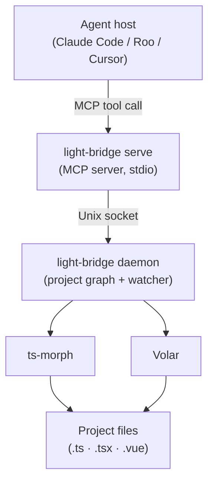

# light-bridge

A refactoring bridge between AI coding agents and the compiler APIs that understand your codebase.

> **Experimental.** This project is in active development. The goal is deterministic, token-reducing refactoring for AI agents through compiler-driven semantics, drawing inspiration from IDE integration patterns. Core operations are stable and tested, but some features remain incomplete or will evolve as we explore better approaches.

AI agents can read and write files, but cross-file refactoring is expensive. Renaming a shared symbol or moving a file means loading every affected file into context, manually patching import paths, and hoping nothing is missed. light-bridge removes that burden — the agent issues an intent, light-bridge handles the cascade, and the agent gets back a semantic summary without ever seeing the raw diffs.

**[Why light-bridge?](docs/why.md)** — speed, determinism, and context efficiency; how it fits into the AI coding ecosystem.

## How it works

light-bridge has two layers:

**Daemon** — a long-lived process that loads the project graph into memory and watches the filesystem for changes. It stays alive between agent sessions so the engine is always warm. Start it once; it handles the rest.

**MCP server** (`light-bridge serve`) — a thin process started by the agent host for each session. It connects to the running daemon, receives tool calls from the agent over stdio, and returns semantic summaries. If no daemon is running, it spawns one automatically.

The underlying language intelligence comes from ts-morph (pure TypeScript projects) and Volar (projects containing Vue files), covering both `.ts` and `.vue` files in a unified project graph.

The agent calls tools. light-bridge applies changes. The context window stays clean.



## Installation

```bash
pnpm add -D @yearofthedan/light-bridge
# or
npm install -D @yearofthedan/light-bridge
```

Or install from GitHub for unreleased builds:

```bash
pnpm add -D github:yearofthedan/light-bridge
```

## CLI Commands

### `light-bridge daemon`

Start the daemon for a workspace. Loads the project graph, starts the filesystem watcher, and listens for connections from `serve` instances.

```bash
light-bridge daemon --workspace /path/to/project
```

Output (stderr):

```json
{ "status": "ready", "workspace": "/absolute/path/to/project" }
```

The daemon runs until terminated with SIGTERM or SIGINT. It does not exit when agent sessions end.

### `light-bridge serve`

Start the MCP server for an agent session. Connects to the running daemon (spawning it if needed) and accepts tool calls over stdio.

```bash
light-bridge serve --workspace /path/to/project
```

Output (stderr):

```json
{ "status": "ready", "workspace": "/absolute/path/to/project" }
```

Terminates cleanly on SIGTERM. The daemon continues running after the session ends.

### `light-bridge stop`

Stop a running daemon for a workspace.

```bash
light-bridge stop --workspace /path/to/project
```

Output (stdout):

```json
{ "ok": true, "stopped": true }
```

## MCP tools

All refactoring operations are exposed as MCP tools via `light-bridge serve`. The agent host calls them; light-bridge handles the cascade.

| Tool | TS | Vue | Read-only | Notes |
|---|---|---|---|---|
| `rename` | ✓ | ✓ | no | Renames a symbol at a given position; updates every reference project-wide |
| `moveFile` | ✓ | ✓ | no | Moves a file; rewrites all import paths that reference it |
| `moveSymbol` | ✓ | ✓* | no | Moves a named export to another file; updates all importers |
| `deleteFile` | ✓ | ✓† | no | Deletes a file; removes every import and re-export of it across the workspace |
| `extractFunction` | ✓ | — | no | Extracts a selected block of statements into a new named function at module scope |
| `findReferences` | ✓ | ✓ | yes | Returns every reference to the symbol at a given position |
| `getDefinition` | ✓ | ✓ | yes | Returns definition location(s) for the symbol at a given position |
| `getTypeErrors` | ✓ | — | yes | Returns type errors for a single file or whole project (capped at 100) |
| `searchText` | n/a | n/a | yes | Regex search across workspace files with optional glob/context controls |
| `replaceText` | n/a | n/a | no | Regex replace-all (pattern mode) or exact-position edits (surgical mode) |

All tools take absolute paths. Write operations return `filesModified` and `filesSkipped` (files outside the workspace boundary that were not touched). Write operations also accept `checkTypeErrors: true` to return type diagnostics for modified files in the same response — see `getTypeErrors` for the diagnostic shape.

\* `moveSymbol` supports moving exports from `.ts`/`.tsx` sources inside Vue workspaces and updates `.vue` importers in a post-step. Moving symbols from a `.vue` source file is still pending.

† `deleteFile` removes imports and re-exports from `.ts`/`.tsx`/`.js`/`.jsx` files (via ts-morph) and Vue SFC `<script>` blocks (via regex scan).

## Response format

All operations return a JSON summary:

```json
{
  "ok": true,
  "filesModified": ["src/utils/math.ts", "src/index.ts"]
}
```

On failure:

```json
{
  "ok": false,
  "error": "SYMBOL_NOT_FOUND",
  "message": "Could not find symbol at line 5, column 10"
}
```

## Error codes

- `VALIDATION_ERROR` — invalid command arguments
- `FILE_NOT_FOUND` — source file does not exist
- `SYMBOL_NOT_FOUND` — symbol not found at specified position
- `RENAME_NOT_ALLOWED` — symbol cannot be renamed (e.g. built-in types)
- `NOT_SUPPORTED` — requested operation shape is not supported
- `WORKSPACE_VIOLATION` — path is outside the workspace boundary
- `SENSITIVE_FILE` — operation attempted on a blocked sensitive file
- `TEXT_MISMATCH` — surgical replace precondition failed (`oldText` mismatch)
- `PARSE_ERROR` — malformed request payload or invalid regex
- `REDOS` — unsafe regex rejected
- `INTERNAL_ERROR` — unexpected server-side failure
- `DAEMON_STARTING` — daemon is still initialising; retry the tool call

## Agent integration

`light-bridge serve` is a stdio MCP server. Configure your agent host to launch it for the workspace you want to refactor.

### Claude Code

Add a `.mcp.json` to your project root (checked into version control):

```json
{
  "mcpServers": {
    "light-bridge": {
      "type": "stdio",
      "command": "light-bridge",
      "args": ["serve", "--workspace", "."]
    }
  }
}
```

This uses the `light-bridge` bin from `node_modules/.bin/` and works across different checkout roots (cloud runners, devcontainers) because it avoids hardcoded absolute paths.

For machine-local overrides, add an entry with the Claude CLI instead of editing the committed `.mcp.json`:

```bash
claude mcp add light-bridge -- light-bridge serve --workspace /absolute/path/to/your/project
```

### Roo

Open the Roo MCP settings (gear icon → MCP Servers) and add:

```json
{
  "mcpServers": {
    "light-bridge": {
      "command": "light-bridge",
      "args": ["serve", "--workspace", "/absolute/path/to/your/project"],
      "disabled": false,
      "alwaysAllow": [
        "rename",
        "moveFile",
        "moveSymbol",
        "findReferences",
        "getDefinition",
        "searchText",
        "replaceText"
      ]
    }
  }
}
```

### Guiding the agent (CLAUDE.md)

The MCP tool descriptions tell Claude what each tool does, but not when to reach for them. Add this to your project's `CLAUDE.md` so Claude uses light-bridge instead of manual edits:

````markdown
## Refactoring tools

light-bridge MCP tools are connected. Use them for all structural refactors:

- `mcp__light-bridge__rename` — rename any symbol and update all references (not search-and-replace)
- `mcp__light-bridge__moveFile` — move a file and rewrite all import paths (not `mv` + manual fixes)
- `mcp__light-bridge__moveSymbol` — move a named export between files
- `mcp__light-bridge__extractFunction` — pull a block of statements into a new named function (compiler infers params and return)
- `mcp__light-bridge__findReferences` — find all usages of a symbol before deciding how to refactor
- `mcp__light-bridge__getDefinition` — jump from a symbol usage to its declaration
- `mcp__light-bridge__searchText` / `mcp__light-bridge__replaceText` — safe text search/replace operations with workspace and sensitive-file protections

If a tool returns `DAEMON_STARTING`, retry once — the daemon is still loading the project graph.
Do not read files to verify results; the response lists exactly what changed.
````

### Notes

- Keep the committed `.mcp.json` portable (no single-machine absolute paths).
- Put machine-local path overrides in your user-level MCP config via `claude mcp add ...` so team config stays portable.
- Run `pnpm agent:check` to enforce MCP config conventions in committed files.
- Run `pnpm agent:doctor` as an optional local liveness check if MCP tools are missing or fail to start (it does not enforce a fixed tool contract).
- The daemon auto-spawns on first tool call if not already running. For faster first-call response, start it manually: `light-bridge daemon --workspace /path/to/project`.
- One `serve` instance per agent session; one daemon per workspace. The daemon keeps running between sessions.

## Development

### Prerequisites

- Node.js 18+
- pnpm 8+

### Setup

```bash
pnpm install
```

### Build

```bash
pnpm run build
```

### Test

```bash
pnpm run test
```

### Agent workspace checks

```bash
# Fast static policy check for committed MCP configs (CI-friendly)
pnpm run agent:check

# Optional runtime smoke check for local environment/debugging
pnpm run agent:doctor
```

Tests include:

- **Operation tests** — per-operation behavior and boundary handling (`tests/operations/`)
- **Provider tests** — ts-morph/Volar provider behavior (`tests/providers/`)
- **MCP transport tests** — tool registration and end-to-end MCP calls (`tests/mcp/`)
- **Daemon tests** — lifecycle, socket protocol, watcher, and stop behavior (`tests/daemon/`)
- **Security tests** — workspace boundary and sensitive-file controls (`tests/security/`)
- **Utility tests** — shared path/text/file helpers (`tests/utils/`)

## Project structure

```
src/
├── cli.ts                 # CLI entry point (daemon, serve, stop)
├── schema.ts              # Zod input validation
├── types.ts               # Shared result/provider interfaces
├── security.ts            # Workspace + sensitive-file checks
├── mcp.ts                 # MCP server (connects to daemon)
├── daemon/
│   ├── daemon.ts          # Socket server; daemon lifecycle
│   ├── ensure-daemon.ts   # ensureDaemon, callDaemon, spawnDaemon
│   ├── paths.ts           # Socket/lockfile path utilities
│   ├── dispatcher.ts      # Data-driven operation dispatch
│   └── watcher.ts         # Filesystem watcher + invalidation callbacks
├── operations/
│   ├── rename.ts
│   ├── moveFile.ts
│   ├── moveSymbol.ts
│   ├── deleteFile.ts
│   ├── extractFunction.ts
│   ├── findReferences.ts
│   ├── getDefinition.ts
│   ├── getTypeErrors.ts
│   ├── searchText.ts
│   └── replaceText.ts
├── providers/
│   ├── ts.ts              # TypeScript provider (ts-morph)
│   ├── volar.ts           # Vue provider (Volar)
│   ├── vue-scan.ts        # Vue import rewrite post-steps
│   └── vue-service.ts     # Volar service factory
└── utils/
    ├── text-utils.ts
    ├── file-walk.ts
    ├── ts-project.ts
    ├── relative-path.ts
    ├── assert-file.ts
    └── errors.ts

tests/
├── operations/            # Operation behavior tests
├── providers/             # Provider behavior tests
├── mcp/                   # MCP transport + tool call tests
├── daemon/                # Daemon lifecycle + protocol tests
├── security/              # Boundary and sensitive-file tests
├── utils/                 # Shared utility tests
├── eval/                  # Fixture server unit tests
├── helpers.ts             # Test utilities
└── fixtures/              # Fixture projects

eval/
├── fixture-server.ts      # In-process daemon impersonator; exports startFixtureServer
├── run-eval.ts            # Entry point: starts fixture server, runs promptfoo, tears down
├── promptfooconfig.yaml   # PromptFoo config; 5 positive + 1 negative case
└── fixtures/              # Pre-recorded daemon JSON responses keyed by method name

.github/workflows/
├── ci.yml                 # lint + build + test on push/PR
└── quality-feedback.yml   # mutation testing (weekly + on push to main); triggers Claude Code triage on score < 75

.claude/skills/
├── slice/                 # /slice — pick up and implement the next task
├── spec/                  # /spec — create a spec from a handoff entry
└── mutate-triage/         # /mutate-triage — classify survivors, open issues or fix PRs
```

## License

MIT
