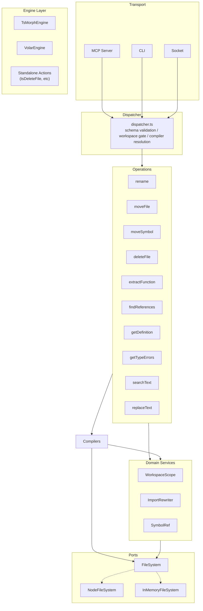
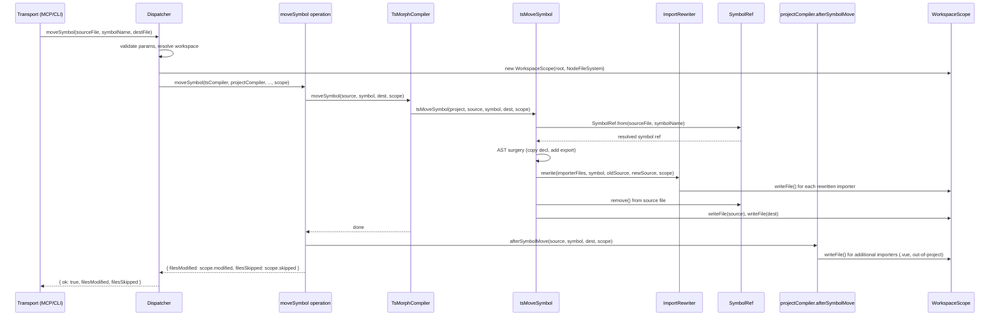

# Architecture

**Purpose:** Architecture reference for compilers, operations, and dispatch. Read before touching anything in `src/operations/`, `src/compilers/`, or `src/daemon/dispatcher.ts`.

See also: `docs/tech/volar-v3.md` (Vue compiler internals), `docs/tech/tech-debt.md` (known issues).

---

## Overview

The engine layer has five tiers: **ports** define I/O abstractions, **domain** holds boundary/tracking logic and value objects, **ts-engine** holds the TypeScript compiler wrapper and action functions, **operations** are orchestrators that delegate to engines, and **plugins** extend functionality for specific frameworks.

```
src/ports/               ← I/O abstractions (hexagonal ports)
  filesystem.ts         ← FileSystem interface + barrel re-exports
  node-filesystem.ts    ← NodeFileSystem — wraps node:fs (production)
  in-memory-filesystem.ts ← InMemoryFileSystem — Map-backed (unit tests)

src/domain/              ← domain logic independent of I/O
  workspace-scope.ts    ← WorkspaceScope — boundary enforcement + modification tracking
  import-rewriter.ts    ← ImportRewriter — rewrites named imports/re-exports of a moved symbol

src/ts-engine/          ← TypeScript engine layer (stateful compiler + action functions)
  types.ts              ← Engine interface (compiler contract + action methods); EngineRegistry
  engine.ts             ← TsMorphEngine — ts-morph Project; per-tsconfig cache; always-available TS fallback
  delete-file.ts        ← tsDeleteFile() — standalone action function for file deletion
  remove-importers.ts   ← tsRemoveImportersOf() — remove all importers of a deleted/moved file

src/operations/          ← standalone orchestrator functions (one per operation)
  rename.ts
  moveFile.ts
  moveSymbol.ts
  deleteFile.ts
  extractFunction.ts
  findReferences.ts
  getDefinition.ts
  getTypeErrors.ts
  searchText.ts
  replaceText.ts

src/plugins/             ← language plugin feature folders (one per framework)
  vue/
    plugin.ts           ← createVueLanguagePlugin() — LanguagePlugin factory (project detection, lifecycle)
    compiler.ts         ← VolarCompiler — implements Engine; Volar proxy; virtual↔real path translation
    scan.ts             ← updateVueImportsAfterMove, removeVueImportsOfDeletedFile
    service.ts          ← buildVolarService() factory
```

Each plugin folder is a self-contained unit: project detection, compiler implementation, and any framework-specific helpers. When adding a new framework (Svelte, Angular), add a new `src/plugins/<name>/` folder following the same shape.

### Design principles

1. **Operations are orchestrators, not implementors.** An operation function should read like a recipe: resolve inputs, call domain services, return results. If it needs comments explaining what a block does, that block is a missing abstraction.
2. **Compiler work belongs behind compiler adapters.** No operation should import from `ts-morph` or call `getProjectForFile()`. The compiler adapter owns all AST access.
3. **I/O goes through ports.** File reads, writes, existence checks — all through the injectable `FileSystem` interface. This is the single biggest testability win: tests inject `InMemoryFileSystem` instead of copying fixtures to temp directories.
4. **Plugins are self-contained feature folders.** The Vue plugin owns everything Vue-specific. Cross-cutting logic (`ImportRewriter`, `WorkspaceScope`) lives in `src/domain/` and is used by plugins, never duplicated inside them.
5. **The workspace boundary is a first-class object.** `WorkspaceScope` encapsulates the root, the `FileSystem`, and modification tracking — not a string threaded through every function signature.
6. **Compute before mutate.** Write operations must separate computation (reading files, resolving edits, validating preconditions) from mutation (writing files, renaming, deleting). If the compute phase fails, no files are modified. This prevents partial-state corruption where some files are updated and others aren't — a state that can't be rolled back because import rewrites touch arbitrary files across the workspace.
7. **Prefer batch compiler APIs over sequential single-file calls.** When an operation involves multiple interdependent files (e.g. moving a directory where files import each other), use the compiler's batch API rather than calling single-file methods in a loop. Sequential calls see intermediate state — each call assumes only its file moved and may rewrite imports incorrectly. Batch APIs compute all changes in the project graph before writing anything to disk.

### Hexagonal layer diagram



### Data flow: moveSymbol (write operation)



### Which operations use which pattern

All mutating operations receive a `WorkspaceScope`, use the `FileSystem` port for I/O, and rely on domain services for boundary tracking and import rewriting. Read-only operations (`findReferences`, `getDefinition`) do not write files and do not take a workspace argument.

**MCP tool names use camelCase.** `rename`, `findReferences`, `getDefinition`, etc. — not kebab-case. This matches TypeScript naming conventions and is visible in the MCP tool descriptions agents read.

---

## Engine interface

Both engines implement `Engine` (defined in `src/ts-engine/types.ts`):

```typescript
interface Engine {
  // Queries
  resolveOffset(file, line, col): number
  getRenameLocations(file, offset): Promise<SpanLocation[] | null>
  getReferencesAtPosition(file, offset): Promise<SpanLocation[] | null>
  getDefinitionAtPosition(file, offset): Promise<DefinitionLocation[] | null>
  readFile(path): string
  notifyFileWritten(path, content): void

  // Actions (delegated to operations)
  deleteFile(targetFile, scope: WorkspaceScope): Promise<{ importRefsRemoved: number }>

  // Legacy methods (migrated to actions in subsequent specs)
  getEditsForFileRename(oldPath, newPath): Promise<FileTextEdit[]>
  afterFileRename(oldPath, newPath, scope: WorkspaceScope): Promise<void>
  afterSymbolMove(sourceFile, symbolName, destFile, scope: WorkspaceScope): Promise<void>
  moveDirectory(oldPath, newPath, scope: WorkspaceScope): Promise<{ filesMoved: string[] }>
}
```

The engine layer is progressively migrating from the legacy interface methods (queries + post-step hooks) to actions that own the full workflow. `deleteFile` is the first action method. Subsequent specs will add `moveFile`, `moveSymbol`, and `rename` as actions, removing the legacy methods each operation replaces.

`TsMorphEngine` delegates to standalone action functions in `src/ts-engine/` (e.g. `tsDeleteFile()` for the delete action). `VolarEngine` delegates to `TsMorphEngine` for TS/JS work, then adds Vue-specific scanning (e.g. scanning `.vue` SFCs for imports of deleted files).

---

## Language plugin contract

The `LanguagePlugin` interface (defined in `src/ts-engine/types.ts`) is the contract for adding language/framework support. Each plugin provides project-level detection and an `Engine` factory:

```typescript
interface LanguagePlugin {
  id: string;                                           // stable identifier, e.g. "vue-volar"
  supportsProject(tsconfigPath: string): boolean;       // project-level detection
  createEngine(tsEngine: TsMorphEngine): Promise<Engine>; // lazy factory, result cached by registry
  invalidateFile?(filePath: string): void;              // selective cache refresh
  invalidateAll?(): void;                               // full cache drop
}
```

**Resolution:** `makeRegistry(filePath)` creates a `TsMorphEngine` first, then finds the tsconfig for the input file and iterates registered plugins in order. The first plugin whose `supportsProject()` returns true provides the `projectEngine` (passing the shared `TsMorphEngine` to its factory). If no plugin matches (or no tsconfig exists), `TsMorphEngine` is used as the default fallback.

**Detection is project-level, not file-level.** In a Vue project, even `.ts` file operations go through VolarEngine because Volar's language service sees both `.ts` and `.vue` importers. The detection checks the project (does this tsconfig cover a Vue project?), not the file extension.

**Built-in plugins:** Vue/Volar is registered at module load time. The TS engine is the always-available fallback — it's not modelled as a plugin.

**Adding a new language plugin:** Implement `LanguagePlugin` with project detection logic, create an `Engine` for your framework's compiler, and call `registerLanguagePlugin()`. The factory receives the shared `TsMorphEngine` for delegation to TS work (AST queries, import rewriting, etc.). See `src/plugins/vue/plugin.ts` as a template.

---

## Engine registry

The registry creates an `EngineRegistry` per request, scoped to the project that contains the input file:

```typescript
interface EngineRegistry {
  projectEngine(): Promise<Engine>                    // first matching plugin, or TsMorphEngine fallback
  tsEngine(): Promise<TsMorphEngine>                  // always TsMorphEngine — for AST-level operations
}
```

`projectEngine` resolution creates a `TsMorphEngine`, finds the tsconfig, then iterates registered `LanguagePlugin` entries. The first plugin's `supportsProject()` that returns true calls its `createEngine(tsEngine)` to create the project engine (usually a wrapper like `VolarEngine` that delegates TS work to the shared engine). If no plugin matches (or no tsconfig exists), `TsMorphEngine` is used as the default fallback.

`tsEngine` is not subject to plugin resolution — it always returns `TsMorphEngine` for operations needing direct ts-morph AST access (e.g. `moveSymbol`, `extractFunction`).

In a monorepo each package resolves to its own tsconfig and gets the right engine automatically. Engines are lazy singletons; each manages a per-tsconfig cache internally.

---

## Operation dispatch

`src/daemon/dispatcher.ts` uses an `OPERATIONS` descriptor table (operation dispatch only — language plugin registration and compiler resolution live in `src/daemon/language-plugin-registry.ts`). Each entry owns:

- `pathParams` — which params are file paths (first entry is used for compiler selection and workspace validation)
- `schema` — Zod schema for input validation at the socket boundary
- `invoke(registry, params, workspace)` — calls the operation function with the resolved compilers

```
tool call (MCP)
  → mcp.ts: TOOLS table → callDaemon(method, params)
  → daemon.ts: socket → dispatchRequest(method, params, workspace)
  → dispatcher.ts: OPERATIONS[method]
      1. validate params (schema.safeParse)
      2. validate path params against workspace boundary (isWithinWorkspace)
      3. makeRegistry(firstPathParam) → CompilerRegistry
      4. descriptor.invoke(registry, params, workspace)
      5. return { ok: true, ...result }
```

Adding a new operation requires one entry in `OPERATIONS` (dispatcher.ts) and one entry in `TOOLS` (mcp.ts). No other files need to change.

---

## Operations

### Mutating

| Operation | Compilers used | Notes |
|-----------|---------------|-------|
| `rename` | `projectCompiler` | Calls `getRenameLocations`; applies edits; returns `filesModified`, `filesSkipped` |
| `moveFile` | `projectCompiler` | Calls `getEditsForFileRename`; renames file; calls `afterFileRename` post-hook |
| `moveSymbol` | `tsCompiler` + `projectCompiler` | Thin orchestrator using `WorkspaceScope`; compiler work in `TsMorphCompiler.moveSymbol()` (impl: `src/compilers/ts-move-symbol.ts`); `afterSymbolMove` hook for Vue SFC importers |
| `moveDirectory` | `projectCompiler` | Calls `compiler.moveDirectory()` for atomic batch move of all source files using ts-morph `directory.move()`; then moves non-source files physically via `scope.fs.rename`. Intra-directory imports are preserved because all files move together in the project graph before any disk writes. |
| `deleteFile` | `tsCompiler` | Removes import/export declarations referencing the deleted file across in-project, out-of-project, and Vue SFC files; physically deletes the file |
| `extractFunction` | `tsCompiler` | Delegates to the TS language service's "Extract Symbol" refactor; replaces auto-generated name with caller-provided name |

### Read-only

| Operation | Compilers used | Notes |
|-----------|---------------|-------|
| `findReferences` | `projectCompiler` | Does not take `workspace` — returns all references, including outside the workspace |
| `getDefinition` | `projectCompiler` | Same — workspace boundary is only enforced on inputs (the query file), not outputs |
| `getTypeErrors` | `tsCompiler` | Returns semantic diagnostics for a single file or all files in the project; errors-only, capped at 100 |

### Filesystem-only (no compiler)

| Operation | Notes |
|-----------|-------|
| `searchText` | Pure filesystem walk; no compiler needed; enforces its own boundary checks |
| `replaceText` | Pattern mode (regex) or surgical mode (edits array); enforces its own boundary checks |

`searchText` and `replaceText` receive a registry but ignore it. The dispatcher still passes `pathParams: []` so workspace validation falls back to the workspace root.

---

## Workspace boundary enforcement

- **Inputs:** the dispatcher validates all `pathParams` against `isWithinWorkspace` before calling the operation
- **Outputs (collateral writes):** each operation checks files before writing; out-of-workspace files are skipped and returned in `filesSkipped`. Agents should surface `filesSkipped` to the user.

Input validation is at the dispatcher layer; output filtering is at the operation layer.

### FileSystem port and WorkspaceScope

`FileSystem` (`src/ports/filesystem.ts`) is a synchronous I/O interface with two implementations: `NodeFileSystem` (wraps `node:fs`) for production and `InMemoryFileSystem` (Map-backed) for unit tests. Both pass the same conformance test suite.

`WorkspaceScope` (`src/domain/workspace-scope.ts`) combines a workspace root with a `FileSystem` instance. It provides:
- `contains(path)` — delegates to `isWithinWorkspace` (preserves symlink-resolution security)
- `writeFile(path, content)` — writes via `FileSystem`, records as modified, throws `WORKSPACE_VIOLATION` if outside workspace
- `recordModified(path)` / `recordSkipped(path)` — modification tracking
- `modified` / `skipped` getters — return tracked paths

The dispatcher constructs a `WorkspaceScope` from the workspace string and a `NodeFileSystem` instance, then passes it to the operation. All mutating operations use `WorkspaceScope`.

`ImportRewriter` (`src/domain/import-rewriter.ts`) rewrites named imports and re-exports of a moved symbol across a set of files. It provides:
- `rewrite(files, symbolName, oldSource, newSource, scope)` — scan files, rewrite matching import/export declarations, write via `scope.writeFile()`
- `rewriteScript(filePath, content, symbolName, oldSource, newSource, scope)` — rewrite a single script string (used by SFC plugins that extract `<script>` blocks themselves)

The rewriter uses throwaway in-memory ts-morph projects for AST-based rewriting. It handles full-move (repoint specifier), partial-move (split and add new import), and merge (combine with existing destination import). Domain services do not know about file formats — SFC extraction is the plugin layer's responsibility.

---

## Compiler invalidation

The watcher (`src/daemon/watcher.ts`) calls into the language plugin registry:

- `invalidateFile(path)` — on file change; cheaper than full rebuild. Refreshes the TS compiler, then iterates all registered language plugins calling `plugin.invalidateFile()`. Errors in one plugin do not block others.
- `invalidateAll()` — on file add/remove; drops the TS compiler singleton and all cached plugin compilers, then calls `plugin.invalidateAll()` on each plugin. Errors are isolated per plugin.

---

## Shared utilities

| File | Purpose |
|------|---------|
| `src/utils/text-utils.ts` | `applyTextEdits()`, `offsetToLineCol()`, `lineColToOffset()` — text manipulation used by operations |
| `src/utils/file-walk.ts` | `walkFiles(dir, extensions)`, `SKIP_DIRS` — in git workspaces shells out to `git ls-files` (respects gitignore); falls back to recursive readdir + `SKIP_DIRS` elsewhere |
| `src/utils/ts-project.ts` | `findTsConfig`, `findTsConfigForFile`, `isVueProject` — project discovery |
| `src/utils/extensions.ts` | `TS_EXTENSIONS`, `JS_EXTENSIONS`, `VUE_EXTENSIONS`, `JS_TS_PAIRS` — file extension constants |
| `src/utils/relative-path.ts` | `computeRelativeImportPath()`, `toRelBase()` — import specifier path calculation |
| `src/utils/assert-file.ts` | `assertFileExists()` — resolves and validates file path, throws `FILE_NOT_FOUND` |
| `src/utils/errors.ts` | `EngineError` class + `ErrorCode` union — structured error type |
| `src/plugins/vue/scan.ts` | `updateVueImportsAfterMove`, `updateVueNamedImportAfterSymbolMove` — regex scans for `.vue` SFC import strings |

## Implementation notes

**Language plugin invalidation hooks must be error-isolated.**
`invalidateFile` and `invalidateAll` iterate all registered plugins. Each plugin's hook is wrapped in try/catch so a crash in one plugin (e.g. a Volar service bug) doesn't prevent other plugins from refreshing their state. The TS compiler is invalidated separately (before the plugin loop) since it's not a plugin.

**`isWithinWorkspace` and `isSensitiveFile` are both in `src/security.ts`.**
`isWithinWorkspace` enforces the workspace boundary at two points: the dispatcher (input path validation) and each operation's output loop (write filtering). It resolves symlinks via `fs.realpathSync` for existing paths to prevent symlink escape. `isSensitiveFile` is called by `searchText` (silently skips) and `replaceText` surgical mode (throws `SENSITIVE_FILE` before touching any file).

**ts-morph internals — see [`docs/tech/ts-morph.md`](tech/ts-morph.md).**
Bundled TypeScript instance, `getProjectForDirectory` vs `getProjectForFile`, and module-level cache gotchas are documented there.
