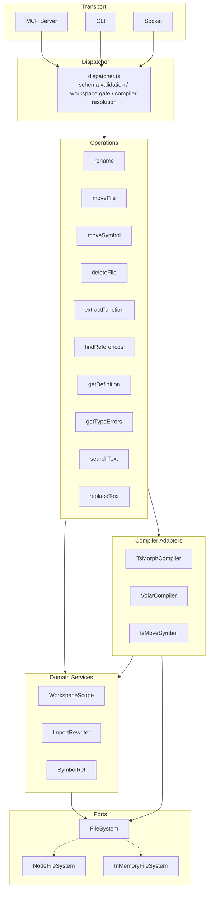
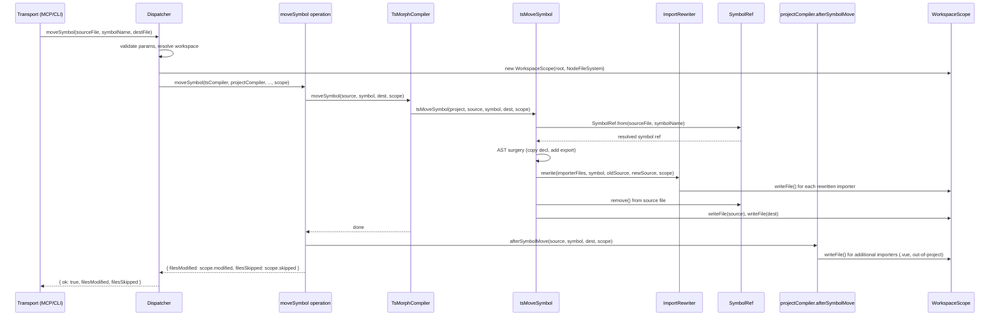

# Architecture

**Purpose:** Architecture reference for compilers, operations, and dispatch. Read before touching anything in `src/operations/`, `src/compilers/`, or `src/daemon/dispatcher.ts`.

See also: `docs/tech/volar-v3.md` (Vue compiler internals), `docs/tech/tech-debt.md` (known issues).

---

## Overview

The engine layer has four tiers: **ports** define I/O abstractions, **domain** holds boundary/tracking logic and value objects, **compilers** hold the stateful compiler objects, and **operations** are standalone functions that orchestrate compilers and domain objects. There are no engine classes.

```
src/ports/               ← I/O abstractions (hexagonal ports)
  filesystem.ts         ← FileSystem interface + barrel re-exports
  node-filesystem.ts    ← NodeFileSystem — wraps node:fs (production)
  in-memory-filesystem.ts ← InMemoryFileSystem — Map-backed (unit tests)

src/domain/              ← domain logic independent of I/O
  workspace-scope.ts    ← WorkspaceScope — boundary enforcement + modification tracking
  import-rewriter.ts    ← ImportRewriter — rewrites named imports/re-exports of a moved symbol
  symbol-ref.ts         ← SymbolRef — resolved exported symbol value object (lookup, unwrap, remove)

src/operations/          ← standalone action functions (one per operation)
  rename.ts
  moveFile.ts
  moveSymbol.ts
  deleteFile.ts
  extractFunction.ts
  findReferences.ts
  getDefinition.ts
  getTypeErrors.ts
  searchText.ts
  replaceText.ts

src/compilers/           ← stateful compiler wrappers
  ts.ts                 ← TsMorphCompiler — ts-morph Project; per-tsconfig cache; always-available TS fallback
  ts-move-symbol.ts     ← tsMoveSymbol() — compiler work for moveSymbol (symbol lookup, AST surgery, import rewriting)

src/plugins/             ← language plugin feature folders (one per framework)
  vue/
    plugin.ts           ← createVueLanguagePlugin() — LanguagePlugin factory (project detection, lifecycle)
    compiler.ts         ← VolarCompiler — Volar proxy; virtual↔real path translation; afterSymbolMove
    scan.ts             ← updateVueImportsAfterMove, updateVueNamedImportAfterSymbolMove
    service.ts          ← buildVolarService() factory
```

Each plugin folder is a self-contained unit: project detection, compiler implementation, and any framework-specific helpers. When adding a new framework (Svelte, Angular), add a new `src/plugins/<name>/` folder following the same shape.

### Hexagonal layer diagram



### Data flow: moveSymbol (write operation)



### Which operations use which pattern

`rename`, `moveFile`, and `moveSymbol` receive a `WorkspaceScope`, use the `FileSystem` port for I/O, and rely on domain services for boundary tracking and import rewriting.

The remaining mutating operations take `workspace: string`, call `fs.*` directly, check `isWithinWorkspace` inline, and track modifications with manual `Set<string>` instances.

| Operation | Boundary / I/O pattern |
|-----------|----------------------|
| `rename` | `WorkspaceScope` + `FileSystem` port |
| `moveFile` | `WorkspaceScope` + `FileSystem` port |
| `moveSymbol` | `WorkspaceScope` + `FileSystem` port |
| `deleteFile` | `workspace: string` + direct `fs.*` |
| `extractFunction` | `workspace: string` + direct `fs.*` |
| `getTypeErrors` | `workspace: string` + direct `fs.*` |
| `searchText` | `workspace: string` + direct `fs.*` (no compiler) |
| `replaceText` | `workspace: string` + direct `fs.*` (no compiler) |

Read-only operations (`findReferences`, `getDefinition`) do not write files and do not take a workspace argument.

---

## Compiler interface

Both compilers implement `Compiler` (defined in `src/types.ts`):

```typescript
interface Compiler {
  resolveOffset(file, line, col): number
  getRenameLocations(file, offset): Promise<SpanLocation[] | null>
  getReferencesAtPosition(file, offset): Promise<SpanLocation[] | null>
  getDefinitionAtPosition(file, offset): Promise<DefinitionLocation[] | null>
  getEditsForFileRename(oldPath, newPath): Promise<FileTextEdit[]>
  readFile(path): string
  notifyFileWritten(path, content): void
  afterFileRename(oldPath, newPath, workspace, alreadyModified?): Promise<{ modified, skipped }>
  afterSymbolMove(sourceFile, symbolName, destFile, scope: WorkspaceScope): Promise<void>
}
```

`afterFileRename` and `afterSymbolMove` are post-step hooks. `TsMorphCompiler.afterSymbolMove` is a fallback scan — it walks workspace TS/JS files outside `tsconfig.include` (test files, scripts) and rewrites imports of the moved symbol that ts-morph's AST pass missed. `VolarCompiler.afterSymbolMove` scans `.vue` SFC script blocks for imports of the moved symbol and rewrites them.

---

## Language plugin contract

The `LanguagePlugin` interface (defined in `src/types.ts`) is the contract for adding language/framework support. Each plugin provides project-level detection and a `Compiler` factory:

```typescript
interface LanguagePlugin {
  id: string;                                      // stable identifier, e.g. "vue-volar"
  supportsProject(tsconfigPath: string): boolean;  // project-level detection
  createCompiler(): Promise<Compiler>;             // lazy factory, result cached by registry
  invalidateFile?(filePath: string): void;         // selective cache refresh
  invalidateAll?(): void;                          // full cache drop
}
```

**Resolution:** `makeRegistry(filePath)` finds the tsconfig for the input file, then iterates registered plugins in order. The first plugin whose `supportsProject()` returns true provides the `projectCompiler`. If no plugin matches (or no tsconfig exists), TsMorphCompiler is used as the default fallback.

**Detection is project-level, not file-level.** In a Vue project, even `.ts` file operations go through VolarCompiler because Volar's language service sees both `.ts` and `.vue` importers. The detection checks the project (does this tsconfig cover a Vue project?), not the file extension.

**Built-in plugins:** Vue/Volar is registered at module load time (`src/daemon/vue-language-plugin.ts`). The TS compiler is the always-available fallback — it's not modelled as a plugin.

**Adding a new language plugin:** Implement `LanguagePlugin` with project detection logic, create a `Compiler` for your framework's compiler, and call `registerLanguagePlugin()`. See `src/daemon/vue-language-plugin.ts` as a template.

---

## Compiler registry

The registry creates a `CompilerRegistry` per request, scoped to the project that contains the input file:

```typescript
interface CompilerRegistry {
  projectCompiler(): Promise<Compiler>              // first matching plugin, or TsMorphCompiler fallback
  tsCompiler(): Promise<TsMorphCompiler>            // always TsMorphCompiler — for AST-level operations
}
```

`projectCompiler` resolution iterates registered `LanguagePlugin` entries (see above). `tsCompiler` is not subject to plugin resolution — it always returns TsMorphCompiler for operations needing direct ts-morph AST access (e.g. `moveSymbol`, `extractFunction`).

In a monorepo each package resolves to its own tsconfig and gets the right compiler automatically. Compilers are lazy singletons; each manages a per-tsconfig cache internally.

---

## Operation dispatch

`src/daemon/dispatcher.ts` uses an `OPERATIONS` descriptor table (operation dispatch only — language plugin registration and compiler resolution live in `src/daemon/language-plugin-registry.ts`). Each entry owns:

- `pathParams` — which params are file paths (first entry is used for compiler selection and workspace validation)
- `schema` — Zod schema for input validation at the socket boundary
- `invoke(registry, params, workspace)` — calls the operation function with the resolved compilers

```
tool call (MCP)
  → mcp.ts: TOOLS table → callDaemon(method, params)
  → daemon.ts: socket → dispatchRequest(method, params, workspace)
  → dispatcher.ts: OPERATIONS[method]
      1. validate params (schema.safeParse)
      2. validate path params against workspace boundary (isWithinWorkspace)
      3. makeRegistry(firstPathParam) → CompilerRegistry
      4. descriptor.invoke(registry, params, workspace)
      5. return { ok: true, ...result }
```

Adding a new operation requires one entry in `OPERATIONS` (dispatcher.ts) and one entry in `TOOLS` (mcp.ts). No other files need to change.

---

## Operations

### Mutating

| Operation | Compilers used | Notes |
|-----------|---------------|-------|
| `rename` | `projectCompiler` | Calls `getRenameLocations`; applies edits; returns `filesModified`, `filesSkipped` |
| `moveFile` | `projectCompiler` | Calls `getEditsForFileRename`; renames file; calls `afterFileRename` post-hook |
| `moveSymbol` | `tsCompiler` + `projectCompiler` | Thin orchestrator using `WorkspaceScope`; compiler work in `TsMorphCompiler.moveSymbol()` (impl: `src/compilers/ts-move-symbol.ts`); `afterSymbolMove` hook for Vue SFC importers |
| `deleteFile` | `tsCompiler` | Removes import/export declarations referencing the deleted file across in-project, out-of-project, and Vue SFC files; physically deletes the file |
| `extractFunction` | `tsCompiler` | Delegates to the TS language service's "Extract Symbol" refactor; replaces auto-generated name with caller-provided name |

### Read-only

| Operation | Compilers used | Notes |
|-----------|---------------|-------|
| `findReferences` | `projectCompiler` | Does not take `workspace` — returns all references, including outside the workspace |
| `getDefinition` | `projectCompiler` | Same — workspace boundary is only enforced on inputs (the query file), not outputs |
| `getTypeErrors` | `tsCompiler` | Returns semantic diagnostics for a single file or all files in the project; errors-only, capped at 100 |

### Filesystem-only (no compiler)

| Operation | Notes |
|-----------|-------|
| `searchText` | Pure filesystem walk; no compiler needed; enforces its own boundary checks |
| `replaceText` | Pattern mode (regex) or surgical mode (edits array); enforces its own boundary checks |

`searchText` and `replaceText` receive a registry but ignore it. The dispatcher still passes `pathParams: []` so workspace validation falls back to the workspace root.

---

## Workspace boundary enforcement

- **Inputs:** the dispatcher validates all `pathParams` against `isWithinWorkspace` before calling the operation
- **Outputs (collateral writes):** each operation checks files before writing; out-of-workspace files are skipped and returned in `filesSkipped`. Agents should surface `filesSkipped` to the user.

Input validation is at the dispatcher layer; output filtering is at the operation layer.

### FileSystem port and WorkspaceScope

`FileSystem` (`src/ports/filesystem.ts`) is a synchronous I/O interface with two implementations: `NodeFileSystem` (wraps `node:fs`) for production and `InMemoryFileSystem` (Map-backed) for unit tests. Both pass the same conformance test suite.

`WorkspaceScope` (`src/domain/workspace-scope.ts`) combines a workspace root with a `FileSystem` instance. It provides:
- `contains(path)` — delegates to `isWithinWorkspace` (preserves symlink-resolution security)
- `writeFile(path, content)` — writes via `FileSystem`, records as modified, throws `WORKSPACE_VIOLATION` if outside workspace
- `recordModified(path)` / `recordSkipped(path)` — modification tracking
- `modified` / `skipped` getters — return tracked paths

The dispatcher constructs a `WorkspaceScope` from the workspace string and a `NodeFileSystem` instance, then passes it to the operation. Currently `rename`, `moveFile`, and `moveSymbol` use `WorkspaceScope`; other operations still receive `workspace: string` and are migrated in subsequent slices.

`ImportRewriter` (`src/domain/import-rewriter.ts`) rewrites named imports and re-exports of a moved symbol across a set of files. It provides:
- `rewrite(files, symbolName, oldSource, newSource, scope)` — scan files, rewrite matching import/export declarations, write via `scope.writeFile()`
- `rewriteScript(filePath, content, symbolName, oldSource, newSource, scope)` — rewrite a single script string (used by SFC plugins that extract `<script>` blocks themselves)

The rewriter uses throwaway in-memory ts-morph projects for AST-based rewriting. It handles full-move (repoint specifier), partial-move (split and add new import), and merge (combine with existing destination import). Domain services do not know about file formats — SFC extraction is the plugin layer's responsibility.

---

## Compiler invalidation

The watcher (`src/daemon/watcher.ts`) calls into the language plugin registry:

- `invalidateFile(path)` — on file change; cheaper than full rebuild. Refreshes the TS compiler, then iterates all registered language plugins calling `plugin.invalidateFile()`. Errors in one plugin do not block others.
- `invalidateAll()` — on file add/remove; drops the TS compiler singleton and all cached plugin compilers, then calls `plugin.invalidateAll()` on each plugin. Errors are isolated per plugin.

---

## Shared utilities

| File | Purpose |
|------|---------|
| `src/utils/text-utils.ts` | `applyTextEdits()`, `offsetToLineCol()`, `lineColToOffset()` — text manipulation used by operations |
| `src/utils/file-walk.ts` | `walkFiles(dir, extensions)`, `SKIP_DIRS` — in git workspaces shells out to `git ls-files` (respects gitignore); falls back to recursive readdir + `SKIP_DIRS` elsewhere |
| `src/utils/ts-project.ts` | `findTsConfig`, `findTsConfigForFile`, `isVueProject` — project discovery |
| `src/utils/extensions.ts` | `TS_EXTENSIONS`, `JS_EXTENSIONS`, `VUE_EXTENSIONS`, `JS_TS_PAIRS` — file extension constants |
| `src/utils/relative-path.ts` | `computeRelativeImportPath()`, `toRelBase()` — import specifier path calculation |
| `src/utils/assert-file.ts` | `assertFileExists()` — resolves and validates file path, throws `FILE_NOT_FOUND` |
| `src/utils/errors.ts` | `EngineError` class + `ErrorCode` union — structured error type |
| `src/plugins/vue/scan.ts` | `updateVueImportsAfterMove`, `updateVueNamedImportAfterSymbolMove` — regex scans for `.vue` SFC import strings |

## Implementation notes

**Language plugin invalidation hooks must be error-isolated.**
`invalidateFile` and `invalidateAll` iterate all registered plugins. Each plugin's hook is wrapped in try/catch so a crash in one plugin (e.g. a Volar service bug) doesn't prevent other plugins from refreshing their state. The TS compiler is invalidated separately (before the plugin loop) since it's not a plugin.

**`isWithinWorkspace` and `isSensitiveFile` are both in `src/security.ts`.**
`isWithinWorkspace` enforces the workspace boundary at two points: the dispatcher (input path validation) and each operation's output loop (write filtering). It resolves symlinks via `fs.realpathSync` for existing paths to prevent symlink escape. `isSensitiveFile` is called by `searchText` (silently skips) and `replaceText` surgical mode (throws `SENSITIVE_FILE` before touching any file).

**ts-morph internals — see [`docs/tech/ts-morph.md`](tech/ts-morph.md).**
Bundled TypeScript instance, `getProjectForDirectory` vs `getProjectForFile`, and module-level cache gotchas are documented there.
